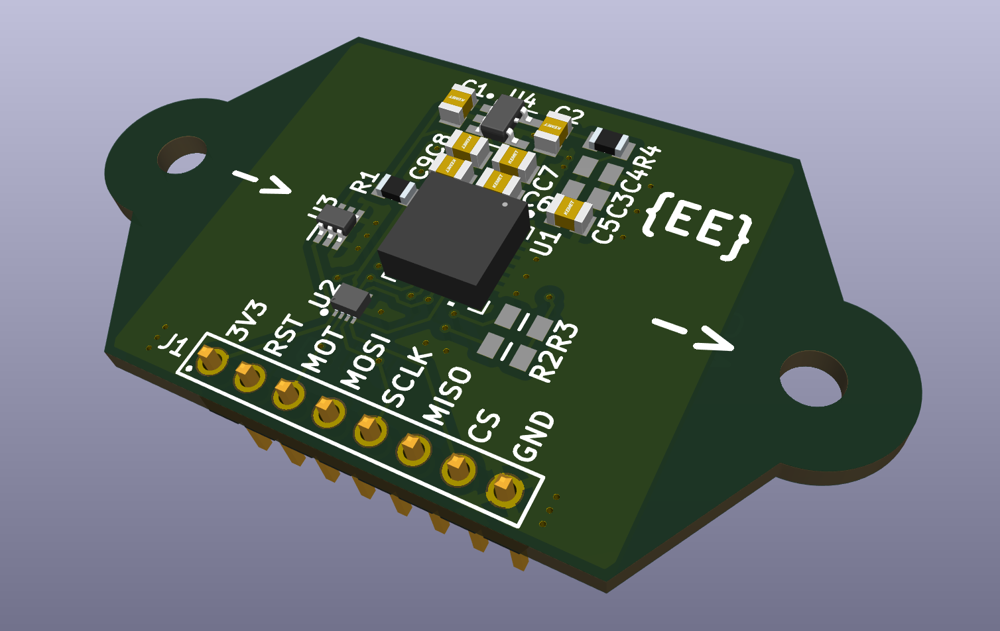
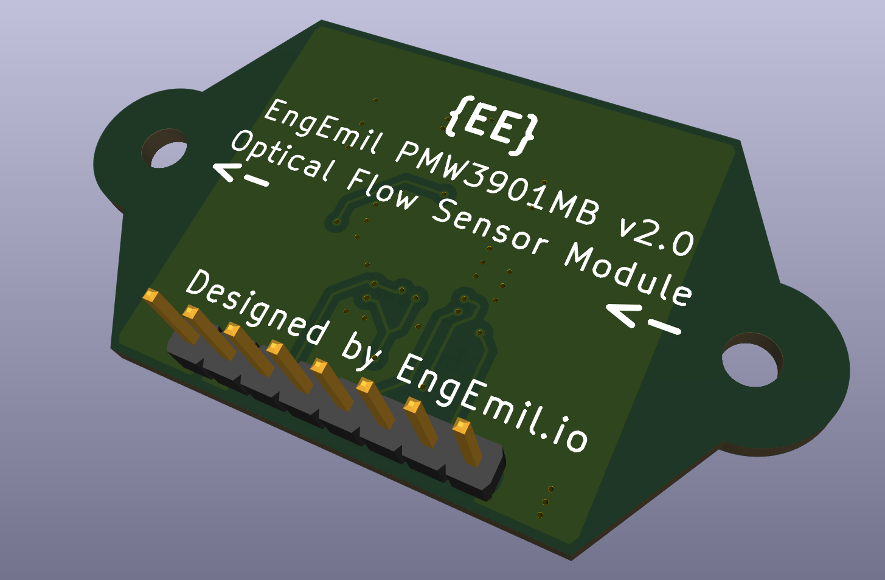

# EngEmil PMW3901MB Optical Flow Sensor Module

The EngEmil PMW3901MB Module is a Optical Motion Tracking Chip module, for optical position control of drones. The PCB module is designed with KiCAD 9.

## Versions

**Version 2**
- Removed 3v3 regulator and changed VCC pin text to 3V3
- Added ESD protection
- Added reverse voltage protection
- Added pull-up resistors for SCLK and MISO. Marked as not mounted.
- Added resistor for RC-filter for PMW3901MB. Marked as R4=0ohm, and C3 and C4 not mounted. Note added in schematic.

**Version 1**
- First prototype
- 3v3 regulator and 1v8 regulator
- Standard pins
- 2 mounting holes

## Links

- PMW3901MB-TXQT https://www.pixart.com/products-detail/44/PMW3901MB-TXQT
- Generating Gerbers (Manufacturer Recommendations): https://docs.oshpark.com/design-tools/kicad/generating-kicad-gerbers/
- Design Rule (Manufacturer Recommendations):
    - https://docs.oshpark.com/design-tools/kicad/kicad-design-rules/
    - https://www.pcbway.com/pcb_prototype/Pinted_Circuit_Board_Prototype.html
    - https://www.pcbway.com/capabilities.html
    - https://jlcpcb.com/capabilities/pcb-capabilities

