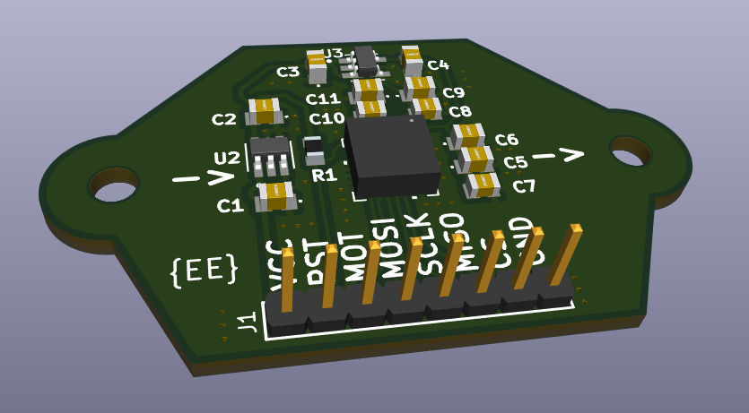
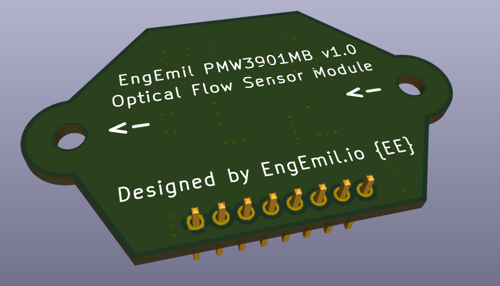

# EngEmil PMW3901MB Optical Flow Sensor Module

The EngEmil PMW3901MB Module is a Optical Motion Tracking Chip module, for optical position control of drones. The PCB module is designed with KiCAD 9.

## Links

- PMW3901MB-TXQT https://www.pixart.com/products-detail/44/PMW3901MB-TXQT

